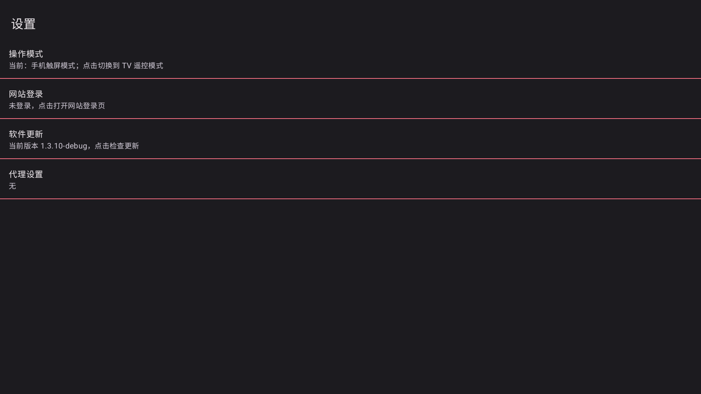
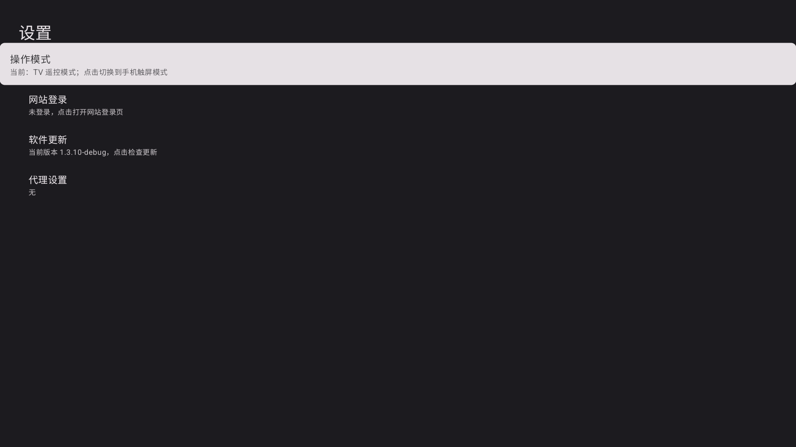

# 操作模式切换

应用首次启动会根据系统自动选择 TV 遥控模式或手机触屏模式。手动切换后，会记住选择，重新启动仍使用所选模式。

## 切换入口

- 首页顶部的电视/手机图标：图标表示将要切换到的模式。
- 设置页第一项「操作模式」：显示当前模式和点击后的目标模式。
- 触屏播放器顶部的电视图标，或 TV 播放器进度条下方的手机图标。

模式入口支持触摸点击和遥控方向键、确认键。在手机上切入 TV 模式后，仍可触摸模式入口切回。

播放中切换会重建控制界面，可能短暂缓冲。当前剧集、播放进度、播放/暂停状态、倍速和字幕偏好会保留。

## 设置界面

以下为 Android 15 设备上功能验收时的 Debug 包截图，画面尺寸为 1920 × 1080。

## 验证范围

v1.4.0 发布前在 SM-S921B（Android 15）上验证了首页、设置和播放器的双向切换、选择持久化、触摸操作与 ADB 模拟遥控按键。真实视频及本地测试视频均完成播放切换检查；精确位置、暂停、倍速、字幕偏好、零进度、临近片尾和连续往返切换均通过。

该轮验收不包含独立 Android TV 系统及“一起看”多人联网会话。
